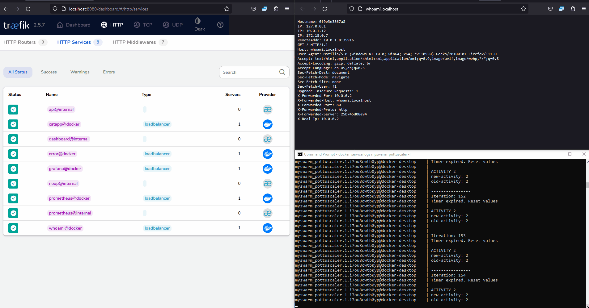

# Autoscaling using Traefik metrics, Prometheus and Docker API

In this exercise, a service has been set up to automatically scale when certain conditions are met. The service is implemented in Python and fetches metrics from Traefik via the Prometheus API. Based on these metrics, the service determines whether to scale up or down.

As an example, if there have been more than 10 requests to the service within a 10-second window, the service will trigger an upward scaling operation. Similarly, the same commands can be used to initiate a downward scaling operation.

> While there are many metrics that can be used to determine scaling, the specific metrics chosen will depend on the needs of your application.

## How to setup?

### 1. Initalization:
- `docker swarm init`
- `docker network create -d overlay inbound`
- `docker stack deploy myswarm -c docker-compose.yml`

### 2. Go to folder *./scaler/* and run commands:
- `docker-compose build`
- `docker stack deploy myswarm -c docker-compose.yml`

> This will deploy current service to the swarm

### 3. You can monitor the "scaler"-service logs here:
`docker service logs myswarm_pottuscaler -f`

Or in the *Docker Desktop*


### 4. Autoscaler testing
You can see the number of service instances here:
http://localhost:8080/dashboard/#/http/services

1. Go to http://whoami.localhost and update the page in a rapid manner.




<br>

---

## Docker API Basic usage

### 1. DockerAPI Permissions
Container needs access to the DockerAPI and this can be done by adding **docker.sock**-path to the *volumes*

```yaml
volumes:
  - /var/run/docker.sock:/var/run/docker.sock
```

### 2. DockerAPI address inside the containers

This works out with *http+unix-socket*-address. Example how to make `docker ps` command using Docker API

[DockerAPI docs](https://docs.docker.com/engine/api/v1.41/)

```python
import requests
import requests_unixsocket

session = requests_unixsocket.Session()

docker_api_url = "http+unix://%2Fvar%2Frun%2Fdocker.sock/v1.41"

r = session.get(docker_url+'/services')
print(r.json())
```


