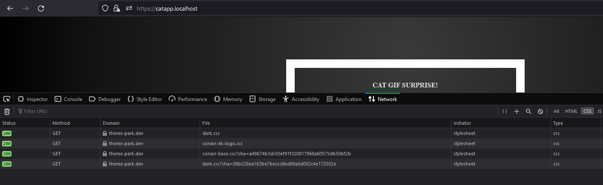
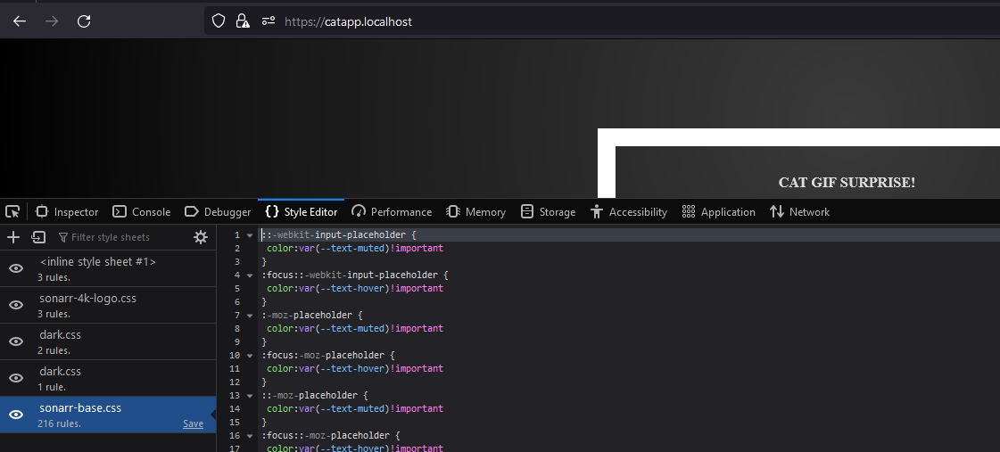

# Traefik V2.x -> V3.x | Traefik Plugins | File separations

For this project, migrating from Traefik V2 to V3 should not require any configuration changes. Most of the changes in V3 are on the backend side, but some advanced options have been removed or renamed. For official guidance on migrating from V2 to V3, [https://doc.traefik.io/traefik/v3.0/migration/v2-to-v3/](https://doc.traefik.io/traefik/v3.0/migration/v2-to-v3/)

In this exercise, we will be using Traefik V3 and separating services into their own Docker Compose files located under /services/. We will also explore Traefik plugins and how they can be configured. Plugins are mostly community-made, with many serving as middlewares that can save time by providing pre-written code. All that is typically required is setting up some configurations.

As an example, we will use a simple maintenance plugin that displays a maintenance page when a trigger file exists. The plugin configurations are located in /services/traefik/.

## Plugins used:
- [maintenance-page](https://plugins.traefik.io/plugins/637ba08fc672f04dd500d1a1/maintenance-page)
- [Theme.park](https://plugins.traefik.io/plugins/62947288ffc0cd18356a97c1/theme-park)
<br>

## How to setup?

### 1. Initalization Windows (Other OS: just copy the docker commands from .bat):
- `start deploy-services.bat`

### 2. Test the maintenance trigger:
1. Check that the service is working: http://whoami.localhost/
2. Open *traefik*-service terminal:
    1. **Docker Desktop** -> myswarm_traefik -> terminal
    2. **Terminal** -> `docker ps` -> copy *myswarm_traefik* CONTAINER ID -> `docker exec -it <CONTAINER-ID> sh`  
3. Trigger maintenance by creating *maintenance_test.trigger*-file inside *traefik*-container
    - `touch /etc/traefik/maintenance_test.trigger`
4. Now **maintenance-middleware** should be active and the *maintenance_test.html* should be rendered: http://whoami.localhost/
    - To end maintenance simply remove the .trigger file: `rm /etc/traefik/maintenance_test.trigger`
    - Maintenance-middleware is not enabled in HTTPS services
        -  https://catapp.localhost/ (Maintenance-middleware not enabled)
        -  http://catapp.localhost/ (Maintenance-middleware enabled)

### 3. OPTIONAL MIDDLEWARE INFORMATION: [Traefik Dashboard Maintenance Middleware](http://localhost:8080/dashboard/#/http/middlewares/my-traefik-maintenance@file)
- Get a quick look which routers are under this middleware

### 4. OPTIONAL MIDDLEWARE USAGE INFORMATION

In this exercise, we created a middleware that is activated for certain services using labels. However, we can also assign middleware to entry point level as global middlewares. This means that every service that is pointed to this entry point will be subject to the middleware.

For example, suppose we have an entry point called "web" and we want to apply a maintenance middleware to all services that use this entry point. We can define the middleware as a global middleware for "web" in the Traefik configuration. Then, any service that uses "web" as its entry point will automatically be subject to the maintenance middleware.

1. Delete middleware assigned to the service: *services/whoami/docker-compose.yml*
    - `- traefik.http.routers.whoami.middlewares=my-traefik-maintenance@file`

2. Configure middleware to the entryPoint *web*: *./traefik.yml*

    ```yml
    entryPoints:
      web:
        address: ":80"
        http:
          middlewares:
            - my-traefik-maintenance@file

      websecure:
        address: ":443"
    ```

<br>


## Required configurations in */services/traefik*

### **1. docker-compose.yml**

Mount dynamic configuration *config.yml* and the maintenance_test.html inside the container.

```yml
    volumes:
      - /var/run/docker.sock:/var/run/docker.sock
      - ./traefik.yml:/etc/traefik/traefik.yml # Static configurations
      - ./config.yml:/etc/traefik/config.yml # Dynamic configurations
      - ./maintenance_test.html:/etc/traefik/maintenance_test.html # Maintenance-page
```

<br>

### **2. config.yml**

Contains the necessary and additional configurations of the plugin. This basic example configuration is in the plugin's page "Install Plugin"

```yml
http:
    middlewares:
        my-traefik-maintenance:
            plugin:
                traefik-maintenance:
                    enabled: "true"
                    filename: /etc/traefik/maintenance_test.html
                    httpContentType: text/html; charset=utf-8
                    httpResponseCode: "503"
                    triggerFilename: /etc/traefik/maintenance_test.trigger # If this file exists: activates this middleware

```

<br>

### **3. traefik.yml**

Provide *Dynamic Configuration (config.yml)* location to traefik and enable "*my-traefik-maintenance*"-middleware for all services running on http (in this example, HTTPS services such as https://catapp.localhost is not affected to this middleware). Provide plugin information to traefik in **experimental**-section


```yml
providers:
  docker:
    swarmMode: true
    network: inbound
    exposedByDefault: false
  file:
    filename: "/etc/traefik/config.yml" # Link to the dynamic configuration
    watch: true  # Watch for modifications


entryPoints:
  web:
    address: ":80"

    # Middlewares enabled for all services running on http
    http:
      middlewares:
        - my-traefik-maintenance@file # -@file: Look this middleware from provided dynamic configuration (config.yml)

  websecure:
    address: ":443"

# Copied from plugin's page "Install Plugin"
experimental:
  plugins:
    traefik-maintenance:
      moduleName: "github.com/TRIMM/traefik-maintenance"
      version: "v1.0.1"
```

<br>

---

## Theme-park plugin

> Theme-park is a CSS-in-JS library that provides theming capabilities to web applications. It allows developers to define a set of design tokens and then use them to create reusable styles for components. With Theme-park, it's easy to switch between different visual themes, and to make styling changes across an entire application with just a few updates to the token definitions.


https://plugins.traefik.io/plugins/62947288ffc0cd18356a97c1/theme-park


## Configurations

### 1. traefik.yml
```yml
# traefik.yml
experimental:
  plugins:
    traefik-themepark:
      moduleName: "github.com/packruler/traefik-themepark"
      version: "v1.3.0"
```

### 2. config.yml
```yml
# config.yml

http:
    middlewares:
        my-traefik-themepark:
            plugin:
                traefik-themepark:
                    app: sonarr # https://docs.theme-park.dev/themes
                    theme: dark # https://docs.theme-park.dev/theme-options/
                    baseUrl: https://theme-park.dev # *optional if you want to use a self-hosted version of theme.park
                    addons: # https://docs.theme-park.dev/themes/addons/
                    - 4k-logo
```

### 3. Add middleware 'my-traefik-themepark@file' to service catapp in */catapp/docker-compose.yml*

```yml
- "traefik.http.routers.catapp-secure.middlewares=basic-auth,test-compress,test-errorpages,test-ratelimit,my-traefik-themepark@file"
```

### 4. Test at https://catapp.localhost/
> Stylings are now fetched from themepark themes.








<br>

> Please note that this plugin cannot be used with the services like **whoami** without additional configurations, as the service does not meet the specific conditions required, such as the presence of a text/html Accept header or HTTP GET Method.